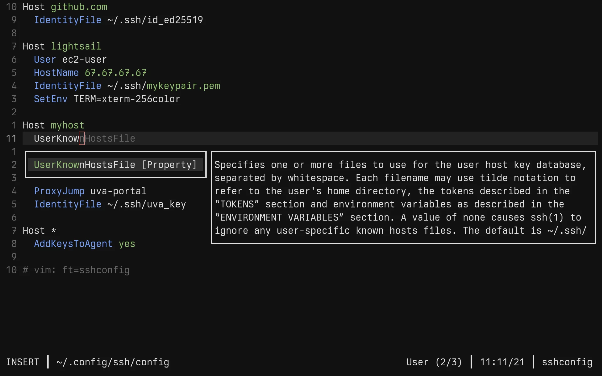

# blink-cmp-ssh

SSH configuration completion source for
[blink.cmp](https://github.com/saghen/blink.cmp).

> [!NOTE]
> Active development is hosted on
> [Forgejo](https://forge.barrettruth.com/barrettruth/blink-cmp-ssh).



## Features

- Completes `ssh_config` keywords with man page documentation
- Provides enum values for keywords with known option sets (ciphers, MACs, key
  exchange algorithms, etc.)
- Keyword and enum data fetched asynchronously at runtime via `man ssh_config`
  and `ssh -Q`

## Requirements

- Neovim 0.10.0+
- [blink.cmp](https://github.com/saghen/blink.cmp)
- `ssh` and `man` executables

## Installation

With `vim.pack` (Neovim 0.12+):

```lua
vim.pack.add({
  'https://forge.barrettruth.com/barrettruth/blink-cmp-ssh',
})
```

Configure `blink.cmp`:

```lua
require('blink.cmp').setup({
  sources = {
    default = { 'ssh' },
    providers = {
      ssh = {
        name = 'SSH',
        module = 'blink-cmp-ssh',
      },
    },
  },
})
```
